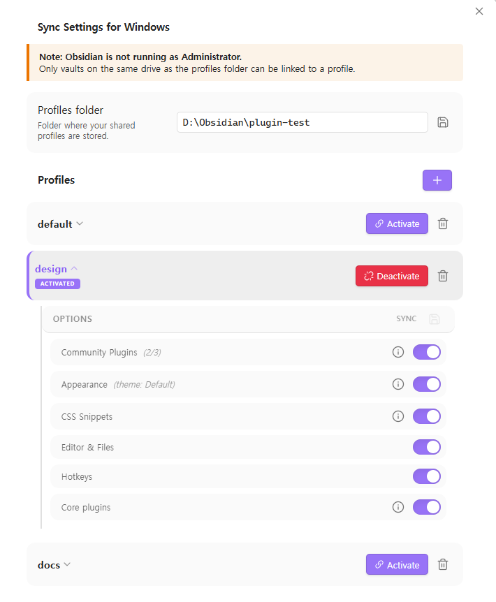

# Sync Settings for Windows

An Obsidian plugin that shares settings (plugins, themes, snippets, hotkeys, etc.) across multiple vaults using profiles.

## Features

- **Profile management** — Create named profiles (e.g. `default`, `work`, `mobile`) in a central folder
- **One-click apply** — Apply a profile to any vault with a single click
- **Selective sync** — Choose which settings to share per profile. Keeps workspace and graph settings local per vault
- **Windows native** — Built for Windows

## How it works

1. Set a **profiles folder** (e.g. `D:\Obsidian\settings\`)
2. Create or select a **profile** — each profile is a subfolder containing shared settings
3. **Apply** the profile to your vault — the plugin links your vault's settings to the profile

Multiple vaults pointing to the same profile will always stay in sync.

## Shared items

| Item | Type |
|---|---|
| `plugins/` | Folder |
| `themes/` | Folder |
| `snippets/` | Folder |
| `appearance.json` | File |
| `app.json` | File |
| `hotkeys.json` | File |
| `community-plugins.json` | File |
| `core-plugins.json` | File |

## Local-only items (not shared)

- `workspace.json`
- `workspace-mobile.json`
- `graph.json`

## Important notes

- **Run Obsidian as Administrator** for best results. This removes all drive restrictions.
- Without Administrator, only vaults on the **same drive** as the profiles folder can be linked.
- After applying or changing a profile, Obsidian may not pick up the new settings immediately due to caching.
- The settings tab may also show stale values until you restart.
- **Restarting Obsidian** will always load the latest settings.

## Installation

### From Obsidian Community Plugins (coming soon)

1. Open **Settings → Community Plugins → Browse**
2. Search for "Sync Settings for Windows"
3. Install and enable

### Manual

1. Download `main.js`, `manifest.json`, and `styles.css` from the [latest release](https://github.com/loah8/sync-settings-for-windows/releases/latest)
2. Create a folder `<vault>/.obsidian/plugins/profile-settings/`
3. Copy the three files into that folder
4. Restart Obsidian and enable the plugin in **Settings → Community Plugins**

## Requirements

- Windows 10 or later
- Obsidian 1.5.0+

## License

[MIT](LICENSE)
